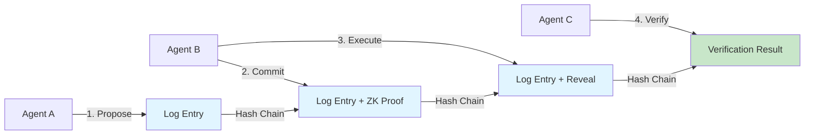
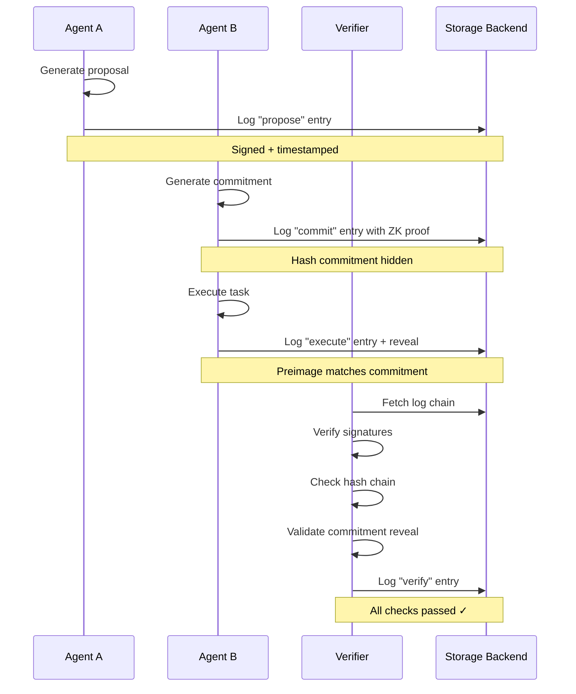
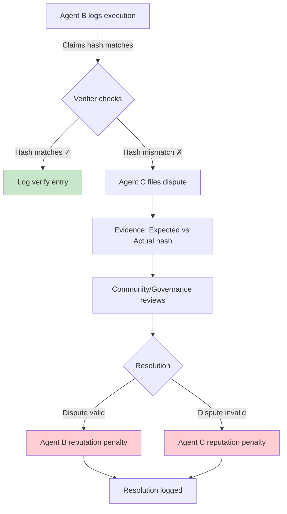

# BotLog Protocol - Visual Diagram Guide

**Purpose**: Suggested diagrams to enhance documentation and social media announcements

---

## 1. Protocol Flow Diagram (for Tweet/X Announcement)

**Recommended for**: Tweet 4 in the announcement thread

**Description**: Simple flowchart showing how a multi-agent interaction works

**Suggested ASCII/Mermaid format**:



**Tools to create**:
- Mermaid Live Editor (https://mermaid.live/)
- Excalidraw (https://excalidraw.com/)
- Figma (for polished version)

**Export**: PNG, 1200x675px (Twitter optimal)

---

## 2. Log Entry Schema Visualization

**Recommended for**: README, documentation, presentations

**Description**: Visual breakdown of a BotLog entry with annotations

```
┌─────────────────────────────────────────────────────┐
│  BotLog Entry v1.0                                  │
├─────────────────────────────────────────────────────┤
│  Timestamp: 2026-01-31T10:00:00Z                   │
├─────────────────────────────────────────────────────┤
│  Actor                                              │
│  ├─ Type: ai | human | service                     │
│  ├─ ID: agent-uuid-001                             │
│  └─ Public Key: [Ed25519 32 bytes]                 │
├─────────────────────────────────────────────────────┤
│  Action                                             │
│  ├─ Type: propose | commit | execute | verify      │
│  ├─ Description: "Completed data analysis"         │
│  └─ Payload: { custom JSON data }                  │
├─────────────────────────────────────────────────────┤
│  Commitments (Optional)                             │
│  └─ [ ZK Proof | Hash | Merkle Root ]              │
├─────────────────────────────────────────────────────┤
│  Cryptographic Binding                              │
│  ├─ Signature: [Ed25519 64 bytes] ───────┐         │
│  ├─ Previous Hash: [SHA-256 32 bytes] ───│──> Chain│
│  └─ Log Hash: [SHA-256 32 bytes] ────────┘         │
└─────────────────────────────────────────────────────┘
```

**Tools to create**:
- ASCII diagram (manual)
- draw.io (https://app.diagrams.net/)
- Lucidchart

---

## 3. Multi-Agent Coordination Sequence

**Recommended for**: Technical presentations, blog posts

**Description**: Sequence diagram showing agent interaction with BotLog



**Tools to create**:
- Mermaid Live Editor
- PlantUML
- WebSequenceDiagrams

---

## 4. Architecture Overview

**Recommended for**: docs/ARCHITECTURE.md (when created)

**Description**: High-level system architecture

```
┌─────────────────────────────────────────────────────────┐
│                    Application Layer                    │
│  (AutoGPT, LangChain, Bittensor, Custom Agents)         │
└────────────────────┬────────────────────────────────────┘
                     │
┌────────────────────┴────────────────────────────────────┐
│                  BotLog Protocol Layer                  │
│  ┌──────────┐  ┌──────────┐  ┌───────────┐            │
│  │ Action   │  │ Commit-  │  │ Verifica- │            │
│  │ Logging  │  │ ments    │  │ tion      │            │
│  └──────────┘  └──────────┘  └───────────┘            │
└────────────────────┬────────────────────────────────────┘
                     │
┌────────────────────┴────────────────────────────────────┐
│                 Cryptographic Layer                     │
│  ┌──────────┐  ┌──────────┐  ┌───────────┐            │
│  │ Ed25519  │  │ SHA-256  │  │ ZK-SNARKs │            │
│  │ Signing  │  │ Hashing  │  │ (Optional)│            │
│  └──────────┘  └──────────┘  └───────────┘            │
└────────────────────┬────────────────────────────────────┘
                     │
┌────────────────────┴────────────────────────────────────┐
│                   Storage Layer                         │
│  (IPFS, Arweave, Local File, Database, Blockchain)     │
└─────────────────────────────────────────────────────────┘
```

---

## 5. Hash Chain Visualization

**Recommended for**: Explaining immutability concept

**Description**: Visual representation of how entries link together

```
Genesis Entry              Entry 2                Entry 3
┌─────────────┐           ┌─────────────┐        ┌─────────────┐
│ Timestamp   │           │ Timestamp   │        │ Timestamp   │
│ Actor       │           │ Actor       │        │ Actor       │
│ Action      │           │ Action      │        │ Action      │
│ Prev: null  │           │ Prev: ──────┼───────>│ Prev: ──────┼──>
│ Hash: abc123│───────────>│ Hash: def456│        │ Hash: ghi789│
└─────────────┘           └─────────────┘        └─────────────┘
     │                         │                       │
     └─ Sign with Ed25519      └─ Sign with Ed25519   └─ Sign...
```

**Visual concept**: Each block contains hash of previous, creating tamper-evident chain

---

## 6. Commitment Flow (Privacy-Preserving)

**Recommended for**: Explaining ZK proofs and commitments

**Description**: Show commit → execute → verify flow with privacy

```
Step 1: Commit                Step 2: Execute              Step 3: Verify
┌──────────────┐             ┌──────────────┐            ┌──────────────┐
│ Agent has    │             │ Agent reveals│            │ Verifier     │
│ secret data  │             │ preimage     │            │ checks match │
│              │             │              │            │              │
│ Hash(secret) │──Log Entry─>│ secret + proof│──Log Entry>│ Hash(secret) │
│              │             │              │            │ == Commitment│
│ ZK Proof:    │             │ Commitment   │            │              │
│ "I know X    │             │ reference    │            │ Result: ✓    │
│  where X>100"│             │              │            │              │
└──────────────┘             └──────────────┘            └──────────────┘
```

---

## 7. Dispute Resolution Process

**Recommended for**: Explaining accountability mechanisms



---

## 8. Comparison with Alternatives (Infographic Style)

**Recommended for**: Blog posts, presentations

```
┌─────────────┬──────────────┬──────────────┬──────────────┐
│ Feature     │ Traditional  │ Blockchain   │ BotLog       │
│             │ Audit Logs   │ (Ethereum)   │ Protocol     │
├─────────────┼──────────────┼──────────────┼──────────────┤
│ Verifiable? │ ❌ Trusted   │ ✅ On-chain  │ ✅ Crypto    │
│             │    server    │              │    sigs      │
├─────────────┼──────────────┼──────────────┼──────────────┤
│ Cost        │ Low          │ High (gas)   │ Minimal      │
├─────────────┼──────────────┼──────────────┼──────────────┤
│ Privacy     │ ❌ Server    │ ❌ Public    │ ✅ ZK proofs │
│             │    access    │    ledger    │              │
├─────────────┼──────────────┼──────────────┼──────────────┤
│ Speed       │ Fast         │ Slow         │ Fast         │
├─────────────┼──────────────┼──────────────┼──────────────┤
│ Central     │ Yes          │ No           │ No           │
│ Authority?  │              │              │              │
└─────────────┴──────────────┴──────────────┴──────────────┘
```

---

## Recommended Tools & Software

### For Quick Diagrams:
- **Mermaid**: Markdown-based, GitHub renders natively
- **Excalidraw**: Hand-drawn style, great for social media
- **ASCII diagrams**: Work anywhere, very lightweight

### For Professional Diagrams:
- **Figma**: Full design control, collaborative
- **draw.io**: Free, powerful, exports to multiple formats
- **Lucidchart**: Professional flowcharts and diagrams

### For Code Visualizations:
- **Carbon**: Beautiful code screenshots (https://carbon.now.sh/)
- **Ray.so**: Modern code presentation

---

## Creating Diagrams for Twitter/X

**Best Practices**:
1. **Aspect Ratio**: 1200x675px (16:9) for optimal display
2. **Contrast**: Use high-contrast colors for mobile readability
3. **Font Size**: Large enough to read on phones (18pt minimum)
4. **Simplicity**: Max 5-7 elements per diagram
5. **Branding**: Optional: Add subtle BotLog logo/colors

**Color Palette Suggestion** (based on trust/tech themes):
- Primary: #0D47A1 (Deep Blue - trust)
- Secondary: #00BCD4 (Cyan - technology)
- Success: #4CAF50 (Green - verification)
- Warning: #FF9800 (Orange - caution)
- Error: #F44336 (Red - disputes)

---

## Example: Ready-to-Use Tweet Image

**For Tweet 4 in announcement thread**:

**Prompt for Midjourney/DALL-E** (if you want AI-generated):
```
"Technical diagram showing three AI agent icons (circles with robot symbols)
connected by arrows, with small document icons between them labeled 'Signed
Log Entry', clean minimalist style, blue and cyan color scheme, white
background, infographic style, --ar 16:9"
```

**Or use Mermaid** (GitHub will render automatically):

Just paste the Mermaid code from section 1 into a `.md` file or GitHub comment.

---

## Contributing Diagrams

If you create useful BotLog diagrams:
1. Open a PR adding them to `/docs/diagrams/`
2. Include source files (.fig, .excalidraw, .mermaid)
3. Export PNGs at 2x resolution for retina displays
4. Add attribution in filename (e.g., `log-flow-by-yourname.png`)

---

**Questions?** Ask in GitHub Discussions or tag @KullAxel on X!
